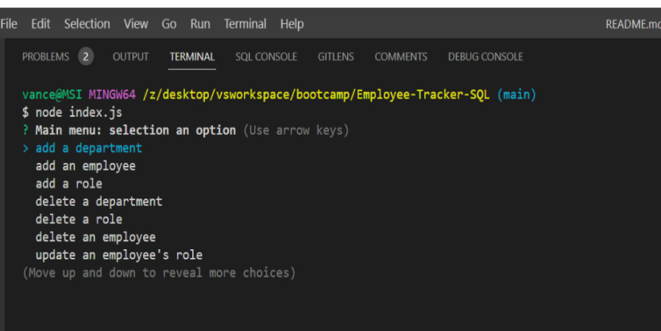

# 12 SQL: Employee Tracker


## Description

This application is designed so that a business can track its employees through a content management systems (CMS). The CMS will help the user easily find the information they are looking for in the database. The CMS will manage a company's employee database, using Node.js, Inquirer, and MySQL.

---

### Table of Contents

- [Installation](#installation)
- [Usage](#usage)
- [Technologies](#technologies)
- [User-Story](#user-story)
- [Acceptance-Criteria](#acceptance-criteria)
- [Screenshots](#screenshots)
- [CodeSnippets](#codeSnippets)
- [License](#license)
- [Contributors](#contributors)
- [Tests](#tests)
- [Important-Information-Questions](#important-information-questions)

---

## Installation

Inquirer 8.20.0, Console Table, and MySQL will need to be installed to run this application.

---

## Usage

After the user Starts the application with node index.js, the user will see a list of prompts. The user will be able to use CRUD functionality to update the database through prompts. 

---

## Technologies

- **MySQL**
- **JavaScript**
- **Inquirer**
- **Node.js**
- **Console Table**

---

## User Story

```md
AS A business owner
I WANT to be able to view and manage the departments, roles, and employees in my company
SO THAT I can organize and plan my business
```

---

## Acceptance Criteria

```md
GIVEN a command-line application that accepts user input
WHEN I start the application
THEN I am presented with the following options: view all departments, view all roles, view all employees, add a department, add a role, add an employee, and update an employee role
WHEN I choose to view all departments
THEN I am presented with a formatted table showing department names and department ids
WHEN I choose to view all roles
THEN I am presented with the job title, role id, the department that role belongs to, and the salary for that role
WHEN I choose to view all employees
THEN I am presented with a formatted table showing employee data, including employee ids, first names, last names, job titles, departments, salaries, and managers that the employees report to
WHEN I choose to add a department
THEN I am prompted to enter the name of the department and that department is added to the database
WHEN I choose to add a role
THEN I am prompted to enter the name, salary, and department for the role and that role is added to the database
WHEN I choose to add an employee
THEN I am prompted to enter the employee’s first name, last name, role, and manager, and that employee is added to the database
WHEN I choose to update an employee role
THEN I am prompted to select an employee to update and their new role and this information is updated in the database 
```

## Screenshots

#### Database schema


#### List of prompts



---

## CodeSnippets

#### Generates all notes that are currently available

```SQL
INSERT INTO employee (first_name, last_name, role_id, manager_id)
Value(?, ?, (SELECT r.id FROM employee_role AS r WHERE r.title = ?),
(SELECT m.id FROM employee AS m WHERE m.first_name = ? AND m.last_name = ? ));
```

#### Passes A SQL query and Array of questions

```JavaScript
const updateInfo = (query, questions) => {
	inquirer.prompt(questions).then((results) => {
		const parameters = [results.name, results.employee];
		dbCon.query(query, parameters, (error, result) => {
			if (error) {
				console.error(error);
			} else {
				displayTable(result);
			}
		});
	});
};
```

---

## Tests

N/A

---

## **Important-Information-Questions**

---

## License

The license used on this project was MIT license

[license link](https://opensource.org/licenses/MIT)

## Contributors

Kyle Vance

## Questions

If you have any questions regarding this project, please reach me by email at vanceofalifetime@protonmail.com

[Live Link](https://drive.google.com/file/d/1yZGCJlbdRP2ytygFQ0-L8Aq4hoeL1xiW/view)

[LinkedIn](https://www.linkedin.com/in/kyle-s-vance/)


